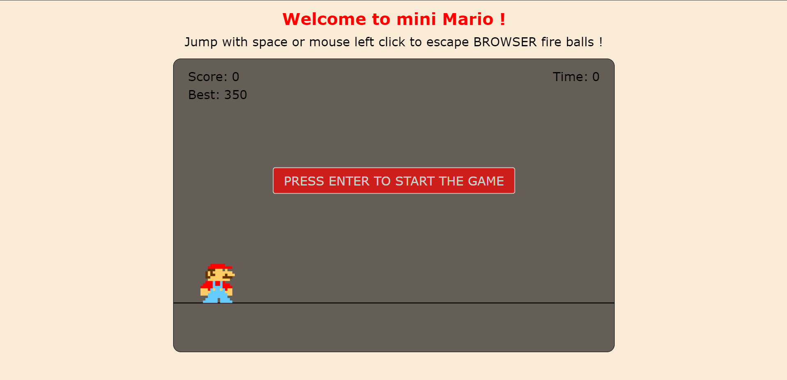

# Mini Marion Canvas Game

Welcome to the Mini Marion Canvas Game! This is a simple game built using HTML5 canvas and JavaScript. 

## Deployment

You can play the game online by visiting the [deployment link](https://bahaa-eddine-mb.github.io/mini-mario-canvas-html/).

## Instructions

1. Clone or download the repository to your local machine.
2. Open the `index.html` file in your web browser.
3. Use the arrow keys to control the Marion character.
4. Avoid the obstacles and try to collect as many points as possible.
5. Enjoy the game!

## Technologies Used

- HTML5
- CSS3
- JavaScript

## Screenshots

